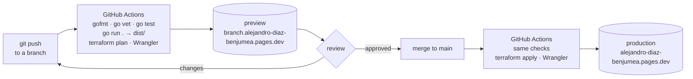

# OminousEyeCV

[](https://github.com/AlexDBdevops/OminousEyeCV/actions/workflows/deploy.yml)
[](LICENSE)

My CV as a website: **https://alejandro-diaz-benjumea.pages.dev**

A bilingual (EN/ES) static site generated with Go, deployed to Cloudflare Pages with Terraform and GitHub Actions. Hosting cost: €0.


## How it works



- **Any other branch:** tests, build, `terraform plan` and a preview deploy on its own `<branch>.alejandro-diaz-benjumea.pages.dev` URL, no pull request needed.
- **Merge to `main`:** `terraform apply` and production deploy.
- **Docs-only changes** (README, docs, changelog, `VERSION`, the local helpers in `tools/`, the tag and cleanup workflows) are tested but never deployed, and they don't bump the version.
- **Cleanup:** after each deploy (and when a branch is deleted) previews of deleted branches and all but the last 3 production deployments are deleted (`tools/cleanup-deployments.sh`).
- **Review:** I check the preview before merging, so nothing reaches `main` unseen.
- **Releases:** bump `VERSION` on `main` and the `tag` workflow creates the git tag. Small changes (a skill, a level, a wording) bump the last digit (v3.2 → v3.2.1); bigger ones bump the middle one (v3.2 → v3.3). Only changes to the site get a version.

## Stack and why

| Piece | Why |
|---|---|
| **Go** static generator (`html/template`, `embed`) | One binary, no runtime dependencies, output is plain files. |
| **Cloudflare Pages** | Free static hosting with global CDN and DDoS protection included; static traffic is never billed. Chosen over AWS (S3 + CloudFront) for guaranteed zero cost. |
| **Terraform** + **HCP Terraform** | The Pages project is infrastructure as code; remote state with locking and history. |
| **GitHub Actions** | CI/CD with actions pinned by SHA, read-only token and no persisted credentials. |
| **Dependabot** | Monthly PRs for actions, the Terraform provider, Wrangler and the CI security tools, only for versions out for at least 7 days, validated by the same pipeline. |

Security: strict Content-Security-Policy (inline scripts allowed only by SHA-256 hash computed at build time), HSTS, `X-Frame-Options: DENY`, COOP/CORP, Permissions-Policy, self-hosted fonts and inline icons, so the page makes no third-party requests. Credentials live outside the repo with minimum permissions. Every tool the pipeline runs is pinned to an exact, checksummed version (`tools/deploy`, `tools/ci`), and every push runs [zizmor](https://docs.zizmor.sh) on the workflows and `govulncheck` on the generator.

## Run locally

```sh
go run .            # builds dist/  (THEME=red go run . for the alternative theme)
go test ./...       # generator tests
TITLE="CV" tools/build_single.sh cyan "$PWD/single.html" a   # single self-contained HTML file
go run . && NODE_PATH=$(npm root -g) node tools/render-assets.js   # regenerate og.png and favicons (Playwright)
```

## Layout

```
content/content.json     all text (EN/ES), experience, skills and levels
content/theme.txt        active theme · content/themes/*.json colours
content/variant.txt      design variant (a = console style)
templates/               HTML template
static/                  CSS, JS, icons, fonts, security headers template
main.go                  build orchestration → dist/
content.go  disc.go  render.go  headers.go  banner.go   generator pieces
generator_test.go        tests
infra/                   Terraform (Cloudflare Pages project)
.github/workflows/       deploy (CI/CD) and tag (releases)
tools/                   single-file build, asset rendering, pinned Wrangler (deploy/) and CI security tools (ci/)
```

More detail (in Spanish) in [ARCHITECTURE.md](ARCHITECTURE.md); release notes in [CHANGELOG.md](CHANGELOG.md).

## Credits

- Built with the assistance of [Claude Code](https://claude.com/claude-code), which wrote much of the code under my direction and review.
- Icons: [Simple Icons](https://simpleicons.org) (CC0) and [Devicon](https://devicon.dev) (MIT).
- Fonts: Syne and IBM Plex (SIL OFL 1.1).

Licensed under [MIT](LICENSE).
